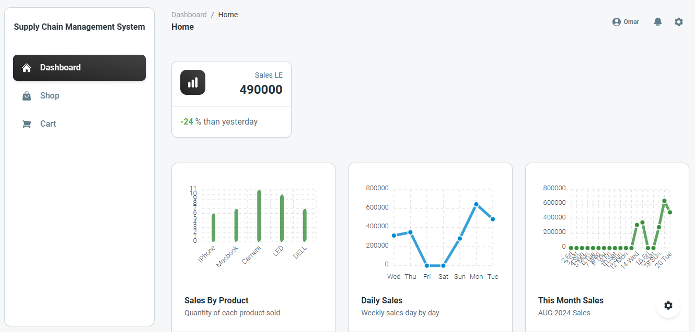
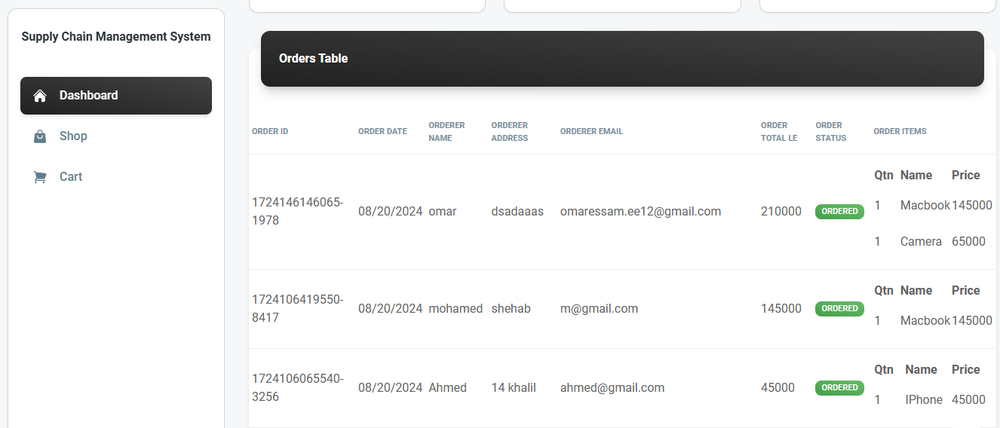
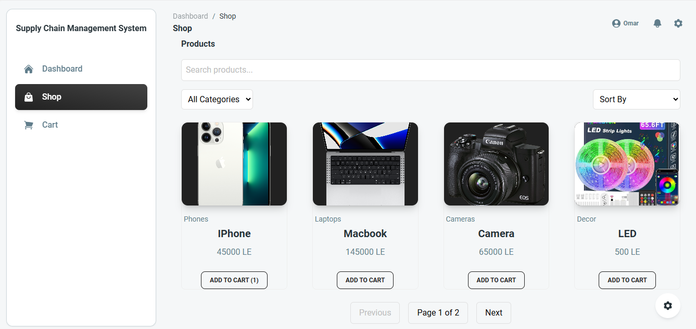
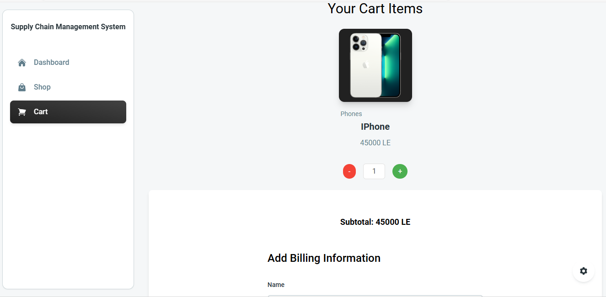

# React & Tailwind - Supply Chain Managment System Website

**This repository showcases a frontend application for a supply chain management system.** The project encompasses three primary tasks:

1. **User Interface Design:** Creation of an intuitive and responsive user interface.
2. **Product Catalog:** Development of a product catalog featuring search, filter, sort, and pagination functionalities.
3. **Order Management and Dashboard:** Implementation of order placement, tracking, and management, along with visual representations of data through charts.

## Terminal Commands

1. Download and Install NodeJs LTS version from [NodeJs Official Page](https://nodejs.org/en/download/).
2. Navigate to the root ./ directory of the product and run `npm install` or `yarn install` or `pnpm install` to install our local dependencies.
3. Inside the SCMS-Website directory write `npm run dev` to start the website.

### Website Images 
* **Page 1: Dashboard Statistics and Chart** 
* **Page 1: Orders Table** 
* **Page 2: Shop** 
* **Page 3: Cart** 

### Check out these videos:
* **Website Tour:** [[here](https://github.com/omarelansary/scms-website/SCMS_Webiste_Overview.mp4)]
* **Responsiveness Demo:** [[here](https://github.com/omarelansary/scms-website/SCMS_Website_Responsivness.mp4)]

